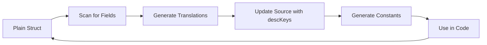

# goopt-i18n-gen

A code generation tool for managing internationalization (i18n) in Go projects, specifically designed for [goopt v2](https://github.com/napalu/goopt) applications.

## Features

- **Type-safe translation keys**: Generate Go constants from JSON translation files
- **Automatic descKey generation**: Scan structs and automatically generate `descKey` tags
- **Translation validation**: Ensure all referenced translation keys exist
- **Multi-locale support**: Process multiple translation files with wildcard patterns
- **Auto-update source files**: Automatically insert generated `descKey` tags into your code
- **360° workflow**: Complete automation from plain structs to fully internationalized apps

## Installation

```bash
go install github.com/napalu/goopt/v2/cmd/goopt-i18n-gen@latest
```

## Quick Start

### 1. Initialize translation files

```bash
goopt-i18n-gen -i locales/en.json init
```

This creates an empty JSON file to hold your translations.

### 2. Audit and generate translations first

```bash
# IMPORTANT: Generate translations BEFORE adding descKeys to avoid broken state
goopt-i18n-gen -i locales/en.json audit -d -g
```

This finds all goopt fields without `descKey` tags and:
- Shows suggested descKey values
- Generates translation entries in your JSON file

### 3. Auto-update source files

```bash
# NOW it's safe to add descKeys since translations exist
goopt-i18n-gen -i locales/en.json audit -d -u
```

This automatically adds the suggested `descKey` tags to your source files.

### 4. Generate type-safe constants

```bash
goopt-i18n-gen -i locales/en.json generate -o messages/keys.go -p messages
```

This creates a Go file with constants for all your translation keys.

### 5. Validate translations

```bash
goopt-i18n-gen -i locales/en.json validate -s "*.go"
```

This ensures all `descKey` references in your code have corresponding translations.

## Understanding audit vs validate

The tool provides two distinct commands that serve different purposes in the i18n workflow:

### When to use `audit`
- **Purpose**: Find goopt struct fields that are missing `descKey` tags
- **Use when**: Adding i18n to existing code or adding new features
- **What it does**: 
  - Scans your Go structs for fields with goopt tags but no descKey
  - Generates appropriate descKey values
  - Can automatically update your source files
- **Example scenario**: You've added a new command with flags but haven't internationalized them yet

### When to use `validate`
- **Purpose**: Ensure all referenced `descKey` tags have translations
- **Use when**: Before releases, in CI/CD, or after adding new descKeys
- **What it does**:
  - Scans for existing descKey references in your code
  - Checks if translations exist for all referenced keys
  - Can generate missing translations
- **Example scenario**: You've added descKeys to your structs and want to ensure all locales have translations

### Typical workflow
1. **Development**: Use `audit -d -g -u` to add i18n to new features
2. **Pre-commit**: Use `validate -s "*.go" -g` to ensure translations exist
3. **CI/CD**: Use `validate -s "*.go" --strict` to enforce completeness

## Commands

### `init`
Initialize empty translation files.

```bash
goopt-i18n-gen -i locales/en.json init
goopt-i18n-gen -i locales/en.json -i locales/es.json init -f  # Force overwrite
```

### `generate`
Generate Go constants from translation JSON files.

```bash
goopt-i18n-gen -i locales/en.json generate -o messages/keys.go -p messages
goopt-i18n-gen -i "locales/*.json" generate -o messages/keys.go  # Process all locales
```

Options:
- `-o, --output`: Output Go file (required)
- `-p, --package`: Package name (default: messages)
- `--prefix`: Optional prefix to strip from keys

### `audit`
Audit goopt fields for missing `descKey` tags.

```bash
goopt-i18n-gen -i locales/en.json audit
goopt-i18n-gen -i locales/en.json audit -d -g  # Generate descKeys and translations
goopt-i18n-gen -i locales/en.json audit -d -u  # Auto-update source files
```

Options:
- `--files`: Go source files to audit (default: *.go)
- `-d, --generate-desc-keys`: Generate descKey tags
- `-g, --generate-missing`: Generate stub translations
- `-u, --auto-update`: Automatically update source files
- `--key-prefix`: Prefix for generated keys (default: app)
- `--backup-dir`: Directory for backup files (default: .goopt-i18n-backup)

### `validate`
Check that all `descKey` references have translations.

```bash
goopt-i18n-gen -i locales/en.json validate -s "*.go"
goopt-i18n-gen -i "locales/*.json" validate -s "*.go" --strict  # For CI/CD
```

Options:
- `-s, --scan`: Go source files to scan for descKey references
- `--strict`: Exit with error if validation fails
- `-g, --generate-missing`: Generate stub entries for missing keys

### `add`
Add translation keys to locale files programmatically.

```bash
# Add a single key
goopt-i18n-gen -i "locales/*.json" add -k "app.feature.enabled" -V "Feature is enabled"

# Add keys from a JSON file
goopt-i18n-gen -i "locales/*.json" add -F new-keys.json

# Dry run to preview changes
goopt-i18n-gen -i "locales/*.json" add -F keys.json -n

# Replace existing keys
goopt-i18n-gen -i "locales/*.json" add -k "app.title" -V "New Title" -m replace
```

Options:
- `-k, --key`: Single key to add
- `-V, --value`: Value for the key (defaults to key name if not provided)
- `-F, --from-file`: JSON file containing key-value pairs to add
- `-m, --mode`: How to handle existing keys (skip, replace, error) - default: skip
- `-n, --dry-run`: Show what would be added without modifying files

Features:
- **Smart Language Detection**: Automatically detects language from filename (en.json → English)
- **TODO Prefixing**: Non-English locales get [TODO] prefix for new values
- **Bulk Operations**: Add multiple keys at once from a JSON file
- **Safe by Default**: Skip mode prevents accidental overwrites
- **Preview Changes**: Dry run shows exactly what will be modified

### `extract`
Extract string literals from Go source files for translation and optionally update source code.

```bash
# Extract all strings from Go files
goopt-i18n-gen -i "locales/*.json" extract

# Extract only strings with spaces (likely user-facing)
goopt-i18n-gen -i "locales/*.json" extract -m ".*\\s+.*"

# Exclude test strings and constants  
goopt-i18n-gen -i "locales/*.json" extract -S "^TEST_|_test$"

# Custom prefix and minimum length
goopt-i18n-gen -i "locales/*.json" extract -P app.ui -l 5

# Dry run with verbose output
goopt-i18n-gen -v -i "locales/*.json" extract -n

# Auto-update: Add TODO comments to source files
goopt-i18n-gen -i "locales/*.json" extract -u

# Auto-update: Replace strings with translation calls
goopt-i18n-gen -i "locales/*.json" extract -u --tr-pattern "tr.T"

# Clean up i18n comments after manual review
goopt-i18n-gen -i "locales/*.json" extract --clean-comments
```

Options:
- `-s, --files`: Go files to scan (default: **/*.go)
- `-m, --match-only`: Regex to match strings for inclusion
- `-S, --skip-match`: Regex to match strings for exclusion
- `-P, --key-prefix`: Prefix for generated keys (default: app.extracted)
- `-l, --min-length`: Minimum string length (default: 2)
- `-n, --dry-run`: Preview what would be extracted
- `-u, --auto-update`: Update source files (add comments or replace strings)
- `--tr-pattern`: Translator pattern for replacements (e.g. tr.T)
- `--keep-comments`: Keep i18n comments after replacement
- `--clean-comments`: Remove all i18n-* comments
- `--backup-dir`: Directory for backup files (default: .goopt-i18n-backup)
- `--transform-mode`: What strings to transform: user-facing, with-comments, all-marked, all (default: user-facing)
- `--user-facing-regex`: Regex patterns to identify custom user-facing functions (can be specified multiple times)
- `--format-function-regex`: Regex pattern and format arg index for custom format functions (pattern:index, can be specified multiple times)

Features:
- **AST-based extraction**: Analyzes Go code structure, not just regex
- **Smart filtering**: Automatically skips constants, generated files, and comments
- **Deduplication**: Same string in multiple places gets one key
- **Location tracking**: Shows where each string was found (with -v flag on global options)
- **Auto-update modes**:
  - Without `--tr-pattern`: Adds `// i18n-todo:` comments next to strings
  - With `--tr-pattern`: Replaces strings with translation calls
- **Format function handling**: Intelligently transforms Printf → Print, Sprintf → direct call, etc.
- **String concatenation**: Detects and extracts concatenated strings in format functions
- **Method awareness**: Shows which method/function contains each string
- **Iterative workflow**: Use comments first, then gradually replace with actual calls
- **Safe defaults**: Uses `app.extracted` prefix to clearly mark auto-extracted strings
- **Structured logging support**: Works well with slog - see [SLOG_USAGE.md](SLOG_USAGE.md) for recommended patterns
- **Custom function detection**: 
  - Use `--user-facing-regex` to identify custom logging/display functions
  - Use `--format-function-regex` to identify custom format functions with argument positions

## Global Options

- `-i, --input`: Input JSON files (comma-separated or wildcards, required)
  - Single file: `-i locales/en.json`
  - Multiple files: `-i "en.json,de.json,fr.json"`
  - Wildcards (recommended): `-i "locales/*.json"`
  - **Important**: goopt uses comma-separated values for slice flags. Do NOT use repeated `-i` flags (e.g., `-i file1.json -i file2.json` won't work - only the last value is used)
- `-v, --verbose`: Enable verbose output
- `-l, --language`: Language for output (en, de, fr)

## The 360° Workflow

The "360° workflow" takes you from plain Go structs to a fully internationalized application:



**The Chicken-and-Egg Problem**: 
- If you add descKeys before translations exist, goopt will display raw keys like "app.global.help_desc" instead of actual translations
- Always generate translations (`scan -g`) BEFORE updating source (`scan -u`)
- To fix a broken state where keys are showing: run `validate -s "*.go" -g` to auto-generate missing translations

### Example Workflow

1. **Start with a plain struct**:
```go
type Config struct {
    Verbose bool `goopt:"short:v;desc:Enable verbose output"`
    Output  string `goopt:"short:o;desc:Output file"`
}
```

2. **Run the 360° workflow**:
```bash
# Option A: Step by step (recommended for understanding)
goopt-i18n-gen -i locales/en.json audit -d -g    # Generate translations first
goopt-i18n-gen -i locales/en.json audit -d -u    # Then update source

# Option B: All at once (for automation)
goopt-i18n-gen -i locales/en.json audit -d -g -u
```

3. **Struct is automatically updated**:
```go
type Config struct {
    Verbose bool `goopt:"short:v;desc:Enable verbose output;descKey:app.config.verbose_desc"`
    Output  string `goopt:"short:o;desc:Output file;descKey:app.config.output_desc"`
}
```

4. **Translation file is populated**:
```json
{
  "app.config.verbose_desc": "Enable verbose output",
  "app.config.output_desc": "Output file"
}
```

5. **Generate constants**:
```bash
goopt-i18n-gen -i locales/en.json generate -o messages/keys.go
```

6. **Use in your code**:
```go
fmt.Println(bundle.T(messages.Keys.AppConfig.VerboseDesc))
```

## Multi-Language Support

### goopt-i18n-gen's Own i18n

The tool itself supports multiple languages. Use the `-l` flag to change the tool's output language:

```bash
goopt-i18n-gen -l de -i "locales/*.json" generate -o messages/keys.go
# Output: "messages/keys.go generiert"

goopt-i18n-gen -l fr -i "locales/*.json" validate -s "*.go"
# Output: "✓ Toutes les références descKey ont des traductions"
```

**Note**: The `-l` flag only affects the tool's messages, not the generated content.

### Processing Multiple Locale Files

You can process multiple locale files in two ways:

**Option 1: Comma-separated list**
```bash
# Generate constants from all keys across all locales
goopt-i18n-gen -i "locales/en.json,locales/de.json,locales/fr.json" generate -o messages/keys.go

# Validate each locale separately
goopt-i18n-gen -i "locales/en.json,locales/de.json,locales/fr.json" validate -s "*.go"
```

**Option 2: Wildcards (recommended)**
```bash
# Generate constants from all keys across all locales
goopt-i18n-gen -i "locales/*.json" generate -o messages/keys.go

# Validate each locale separately
goopt-i18n-gen -i "locales/*.json" validate -s "*.go"

# Update all locale files with missing translations
goopt-i18n-gen -i "locales/*.json" audit -d -g
```

**Important**: The generate command merges keys from ALL specified files, ensuring your constants include every key from every locale.

### Complete Multi-Language Workflow

```bash
# 1. Start with base language
goopt-i18n-gen -i locales/en.json init
goopt-i18n-gen -i locales/en.json audit -d -g --key-prefix myapp
goopt-i18n-gen -i locales/en.json audit -d -u --key-prefix myapp

# 2. Add more languages
cp locales/en.json locales/de.json
cp locales/en.json locales/fr.json
# Edit the new files to translate values

# 3. Generate constants from ALL locales (critical!)
goopt-i18n-gen -i "locales/*.json" generate -o messages/keys.go -p messages

# 4. Validate all locales
goopt-i18n-gen -i "locales/*.json" validate -s "*.go"

# 5. For CI/CD
goopt-i18n-gen -i "locales/*.json" validate -s "*.go" --strict
```

### Extracting and Migrating Hardcoded Strings

The `extract` command provides a powerful workflow for migrating existing code to i18n:

#### Basic Extraction Workflow

```bash
# 1. Preview what will be extracted (dry run with verbose)
goopt-i18n-gen -v -i "locales/*.json" extract -m ".*\\s+.*" -l 5 -n

# 2. Extract and update locale files
goopt-i18n-gen -i "locales/*.json" extract -m ".*\\s+.*" -l 5

# 3. Generate constants for the new keys
goopt-i18n-gen -i "locales/*.json" generate -o messages/keys.go -p messages
```

#### Automated Migration Workflow

```bash
# Step 1: Add TODO comments to all extractable strings
goopt-i18n-gen -i "locales/*.json" extract -u

# Your code now has comments like:
# fmt.Println("Hello world") // i18n-todo: app.extracted.hello_world

# Step 2: Review and manually update some strings, marking them done
# fmt.Println(tr.T(messages.Keys.App.Greeting)) // i18n-done

# Step 3: Auto-replace remaining TODOs with translation calls
goopt-i18n-gen -i "locales/*.json" extract -u --tr-pattern "tr.T"

# Step 4: Clean up any remaining comments
goopt-i18n-gen -i "locales/*.json" extract --clean-comments
```

#### Advanced Extraction Patterns

```bash
# Extract error messages with custom prefix
goopt-i18n-gen -i "locales/*.json" extract -m "(?i)error|fail" -P app.errors

# Extract UI labels (capitalized strings ending with colon)
goopt-i18n-gen -i "locales/*.json" extract -m "^[A-Z][a-z].*:$" -P app.ui.labels

# Extract from specific packages only
goopt-i18n-gen -i "locales/*.json" extract -s "internal/ui/**/*.go" -P app.ui

# Exclude test files and mocks
goopt-i18n-gen -i "locales/*.json" extract -S "_test\.go$|mock" 
```

#### Format Function Transformation

The extract command intelligently handles format functions:

```go
// Before extraction
fmt.Printf("User %s logged in at %v", username, time.Now())
fmt.Sprintf("Welcome %s!", name)
fmt.Errorf("failed to process: %v", err)

// After extraction with --tr-pattern "tr.T"
fmt.Print(tr.T(messages.Keys.AppExtracted.UserSLoggedInAtV, username, time.Now()))
tr.T(messages.Keys.AppExtracted.WelcomeS, name)
errors.New(tr.T(messages.Keys.AppExtracted.FailedToProcessV, err))
```

#### Iterative Migration Strategy

1. **Phase 1 - Discovery**: Use dry run to understand scope
   ```bash
   goopt-i18n-gen -v -i "locales/*.json" extract -n | grep occurrences | wc -l
   ```

2. **Phase 2 - Comment Injection**: Add TODO comments for review
   ```bash
   goopt-i18n-gen -i "locales/*.json" extract -u
   git diff  # Review changes
   ```

3. **Phase 3 - Gradual Migration**: Work package by package
   ```bash
   # Extract and transform one package at a time
   goopt-i18n-gen -i "locales/*.json" extract -s "pkg/auth/**/*.go" -u --tr-pattern "tr.T"
   ```

4. **Phase 4 - Cleanup**: Remove processed comments
   ```bash
   goopt-i18n-gen -i "locales/*.json" extract --clean-comments
   ```

### Adding New Features with the add Command

When developing new features, use the `add` command to efficiently manage translations:

```bash
# 1. Create a JSON file with new feature translations
cat > feature-keys.json <<EOF
{
  "app.feature.title": "Advanced Search",
  "app.feature.query_label": "Search query",
  "app.feature.filters_label": "Search filters",
  "app.feature.results_empty": "No results found",
  "app.feature.results_count": "Found %d results"
}
EOF

# 2. Add to all locale files at once (with [TODO] prefix for non-English)
goopt-i18n-gen -i "locales/*.json" add -F feature-keys.json

# 3. Preview what would be added (dry run)
goopt-i18n-gen -i "locales/*.json" add -F feature-keys.json -n

# 4. For quick single-key additions during development
goopt-i18n-gen -i "locales/*.json" add -k "app.feature.help_text" -V "Click here for help"

# 5. Update existing keys across all locales
goopt-i18n-gen -i "locales/*.json" add -k "app.title" -V "My App v2.0" -m replace
```

Result in locale files:
- `en.json`: Gets exact values from the JSON file
- `de.json`: Gets `"[TODO] Advanced Search"` for `app.feature.title`
- `fr.json`: Gets `"[TODO] Advanced Search"` for `app.feature.title`

## Integration with go:generate

Add these directives to your main.go:

```go
// Basic generation
//go:generate goopt-i18n-gen -i "locales/*.json" generate -o messages/messages.go -p messages

// With validation and auto-fix (recommended)
//go:generate goopt-i18n-gen -i "locales/*.json" validate -s "*.go" -g
//go:generate goopt-i18n-gen -i "locales/*.json" generate -o messages/messages.go -p messages

// For development (using go run)
//go:generate go run . -i "locales/*.json" validate -s "*.go" -g
//go:generate go run . -i "locales/*.json" generate -o messages/messages.go -p messages
```

Then run:
```bash
go generate ./...
```

## Best Practices

1. **Use meaningful key prefixes**: Group related functionality (e.g., `app.auth.login_desc`)
2. **Keep keys hierarchical**: This improves organization in the generated code
3. **Run validation in CI/CD**: Use `--strict` flag to catch missing translations
4. **Commit generated files**: Include the generated constants file in version control
5. **Use wildcards for multi-locale**: Process all translations together to ensure consistency
6. **Use add command for bulk updates**: When adding features, collect all new keys in a JSON file and add them at once
7. **Extract before manual i18n**: Use the extract command to find hardcoded strings before manually adding translations
8. **Review extracted strings**: Always use dry-run (-n) first to review what will be extracted

## Advanced Features

### Working Without desc Attributes

Fields don't need a `desc` attribute. The tool will generate sensible defaults:

```go
// This works fine - tool generates default translation
Verbose bool `goopt:"short:v;descKey:app.verbose"`
```

### Nested Structures

The tool handles nested command structures and flag containers:

```go
type App struct {
    Global GlobalFlags
    Process ProcessCmd `goopt:"kind:command;name:process"`
}

type GlobalFlags struct {
    Verbose bool `goopt:"short:v"`  // Will get descKey suggestion
}

type ProcessCmd struct {
    Format string `goopt:"short:f"`  // Will get descKey suggestion
    Exec goopt.CommandFunc
}
```

### Custom Key Prefixes

Control the generated key structure:

```bash
goopt-i18n-gen -i locales/en.json audit -d --key-prefix myapp
# Generates: myapp.config.verbose_desc
```

## Quick Reference

### Full 360° Workflow (Correct Order)
```bash
goopt-i18n-gen -i locales/en.json init                          # 1. Create file
goopt-i18n-gen -i locales/en.json audit -d -g --key-prefix app   # 2. Generate translations
goopt-i18n-gen -i locales/en.json audit -d -u --key-prefix app   # 3. Update source
goopt-i18n-gen -i "locales/*.json" generate -o messages/keys.go # 4. Generate constants
```

### One-Liner for Complete Setup
```bash
goopt-i18n-gen -i locales/en.json init && \
goopt-i18n-gen -i locales/en.json audit -d -g -u --key-prefix app && \
goopt-i18n-gen -i locales/en.json generate -o messages/keys.go -p messages
```

### Fix Broken State (Raw Keys Showing)
```bash
# If you see raw keys like "app.global.help_desc" in your output:
goopt-i18n-gen -i "locales/*.json" validate -s "*.go" -g
```

## Troubleshooting

### "No files to validate"
Make sure to provide files to scan with the `-s` flag:
```bash
goopt-i18n-gen -i locales/en.json validate -s "*.go"
```

### Wildcards not working
Ensure quotes around wildcard patterns to prevent shell expansion:
```bash
goopt-i18n-gen -i "locales/*.json" generate -o messages/keys.go
```

### Permission denied when updating files
The tool creates backups before modifying files. Ensure you have write permissions in the backup directory (default: `.goopt-i18n-backup`).

## Contributing

Contributions are welcome! Please see the main [goopt repository](https://github.com/napalu/goopt) for contribution guidelines.

## License

Same as goopt v2 - see the main repository for details.

---

## For goopt-i18n-gen Maintainers Only

### Dealing with the Chicken-and-Egg Problem

When renaming commands or making structural changes to goopt-i18n-gen itself, you may encounter a chicken-and-egg problem where the code references message keys that don't exist yet in the generated messages file.

#### Example: Renaming a command (like scan → audit)

1. **The Problem**: 
   - Your code uses `messages.Keys.AppAudit.SomeField`
   - But the messages file still has `AppScan` because it hasn't been regenerated
   - You can't build to regenerate because the code won't compile

2. **The Solution**:
   ```bash
   # Step 1: Temporarily revert code to use old keys
   cd /Users/florent/Documents/src/goopt/v2/cmd/goopt-i18n-gen
   sed -i '' 's/messages\.Keys\.AppAudit/messages.Keys.AppScan/g' main.go
   
   # Step 2: Regenerate messages with the new locale keys
   go run . -i "locales/*.json" generate -o messages/messages.go -p messages
   
   # Step 3: Change code back to use new keys
   sed -i '' 's/messages\.Keys\.AppScan/messages.Keys.AppAudit/g' main.go
   
   # Step 4: Build and test
   go build
   ```

3. **Prevention**:
   - Always update locale JSON files first
   - Keep old message keys temporarily when making structural changes
   - Consider using go:generate with build tags for bootstrap scenarios

### Other Maintenance Notes

- The tool uses its own i18n system (eat-your-dog-food)
- Always test with multiple locales after changes
- Keep in mind that goopt's bundle validation requires all locales to have identical keys
- The generated messages file is committed to avoid bootstrap issues